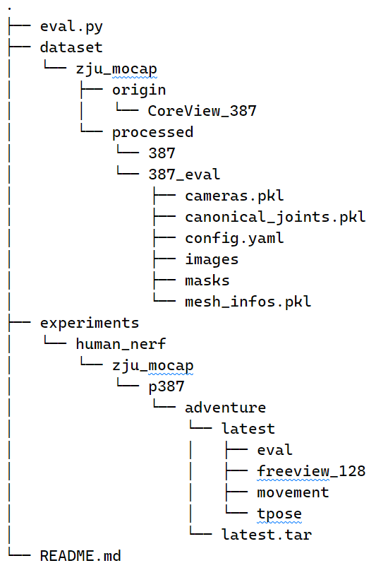
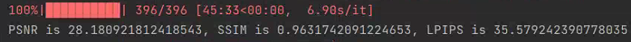
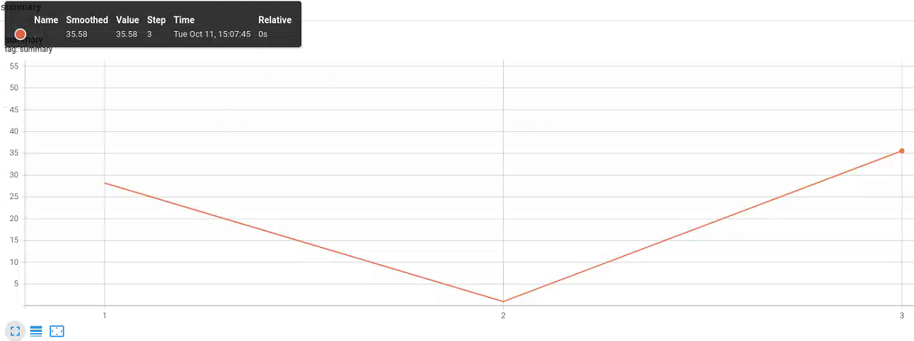
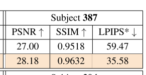

# HumanNeRF-eval
- This repository is an **unofficial** implementation of the HumanNeRF evaluation method. It has achieved the **same evaluation indicators** as the [paper](https://arxiv.org/abs/2201.04127) on the 387 object of the ZJU-MoCap dataset.
- Content related to HumanNeRF can refer to [Related Links](#1)
- If there are errors or improvements in the code, please feel free to submit an issue!
## File structure
- The below structure is just an example to illustrate clearly, not the real directory structure  
- '.' represents the humannerf project root directory  

## Instructions
1. Download and unzip the code
2. Copy the code to the root directory of the HumanNeRF project 
3. Run prepare_dataset_eval.py to process the dataset
    ```
    cd tools/prepare_zju_mocap
    python prepare_dataset_eval.py --cfg 387_eval.yaml
    cd ../../
    ```
4. Run eval.py to evaluate
    ```python eval.py --cfg configs/human_nerf/zju_mocap/387/adventure.yaml```
## Results
### reproduce results


### paper results

## Precautions
- The evaluation log is saved in "cfg.logdir/cfg.load_net/render_folder_name/log", which can be viewed with tensorboard
- The code only tested object 387 of ZJU-MoCap dataset, and other objects have't been tested yet
- If there are errors or improvements in the code, please feel free to submit an issue!
<h2 id='1'>Related Links</h2>

- [HumanNeRF repository](https://github.com/chungyiweng/humannerf)
- [HumanNeRF project homepage](https://grail.cs.washington.edu/projects/humannerf/)
- [ZJU-MoCap dataset](https://github.com/zju3dv/neuralbody/blob/master/INSTALL.md#zju-mocap-dataset)
- [Paper correspond to the ZJU-MoCap dataset](https://arxiv.org/pdf/2012.15838.pdf)
