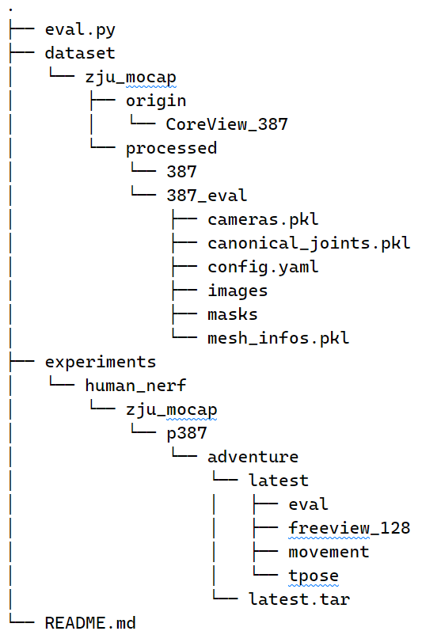
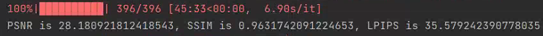
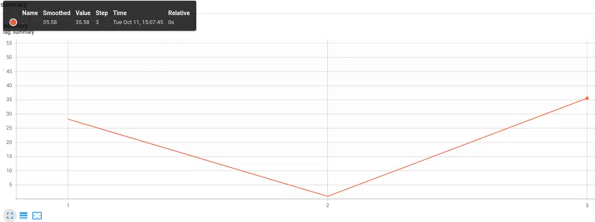
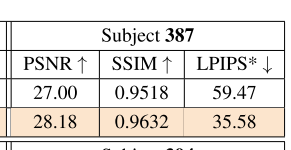

# HumanNeRF-eval
- This repository provides an **unofficial** implementation of the HumanNeRF evaluation method. It **reproduces the same evaluation metrics** as the original [paper](https://arxiv.org/abs/2201.04127) for object 387 from the ZJU-MoCap dataset
- For more information related to HumanNeRF, refer to the [Related Links](#1)
- If you encounter any errors or have suggestions for improvements, feel free to open an issue!

## File Structure
- The following is an example of the project's file structure, and not the actual directory structure. 
- '.' represents the root directory of the HumanNeRF project  


## Usage Guide
1. Download and unzip the code
2. Copy the following content into the root directory of the HumanNeRF project 
    - core
    - tools
    - eval.py
3. Prepare the dataset by running the `prepare_dataset_eval.py` script
```shell
cd tools/prepare_zju_mocap
python prepare_dataset_eval.py --cfg 387_eval.yaml
cd ../../
```
4. Use `eval.py` to run the evaluation
```shell
python eval.py --cfg configs/human_nerf/zju_mocap/387/adventure.yaml
```

## Results
### reproduce results



### paper results


## Notes
- The evaluation log is saved in `cfg.logdir/cfg.load_net/render_folder_name/log` and can be viewed using TensorBoard
- The code has only been tested on object 387 of the ZJU-MoCap dataset. other objects have not been evaluated yet
- If you encounter any errors or have suggestions for improvements, feel free to submit an issue!

<h2 id='1'>Related Links</h2>  

- [HumanNeRF repository](https://github.com/chungyiweng/humannerf)
- [HumanNeRF project homepage](https://grail.cs.washington.edu/projects/humannerf/)
- [ZJU-MoCap dataset](https://github.com/zju3dv/neuralbody/blob/master/INSTALL.md#zju-mocap-dataset)
- [Paper corresponding to the ZJU-MoCap dataset](https://arxiv.org/pdf/2012.15838.pdf)
